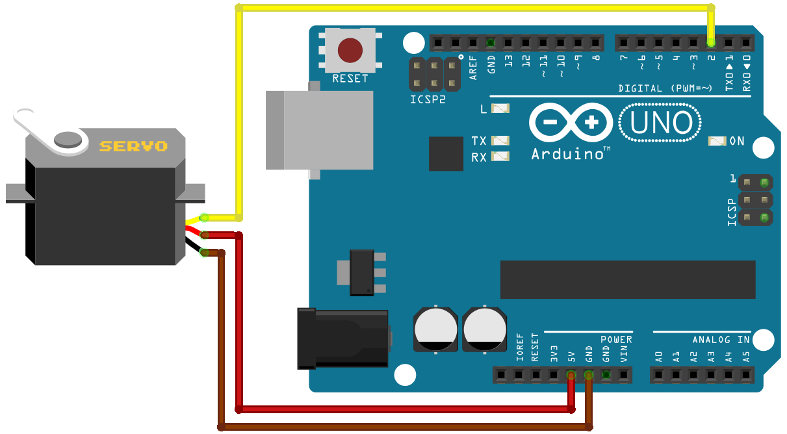
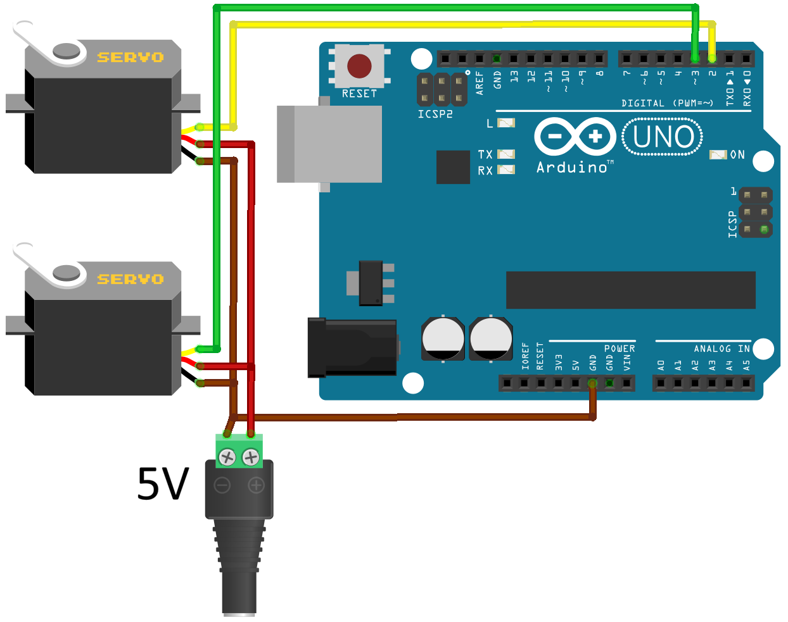

[English](README.md) | [日本語]

# TekuteruServo

TekuteruServoは、標準的なSG90と同じ感覚で使えるシリアルサーボモーターでありながら、実質無制限の回転と精密な位置制御を実現します。

多回転位置決め(±596万回転)を±1°の角度精度と、リアルタイムの位置フィードバックとともに実現しており、標準的なArduino Servoライブラリと互換性のあるインターフェースを提供します。

内部ファームウェアは完全にカスタマイズに開放されており、Arduinoボード1枚だけでサーボのプログラムを簡単に書き換えることができます。

> **⚠ 重要な互換性に関する注意:**
> 本ライブラリは専用のシリアルプロトコルを使用しています。PWMベースのサーボライブラリでは**なく**、標準的なPWMサーボとは**互換性がありません**。この非互換性は双方向です — 標準のServo.hライブラリでTekuteruServoを制御することもできません。

**TekuteruServoのハードウェアはこちらで購入できます:** [**TekuteruServoを購入する**](https://tekuteru.handcrafted.jp/items/121327019)

TekuteruServoに関するご質問は、[Gemini Notebook](https://notebooklm.google.com/notebook/272725f0-6a1c-4c52-9597-6384a2f88f91)の**AIアシスタント**とチャットでご相談いただけます。


## 目次
- [特徴](#特徴)
- [機械的仕様](#機械的仕様)
- [Pythonサポート(Raspberry Pi)](#pythonサポートraspberry-pi)
- [配線ガイド](#配線ガイド)
- [インストール(Arduino IDE)](#インストールarduino-ide)
- [クラスメソッド](#クラスメソッド)
- [使用上の注意](#使用上の注意)
- [コード例](#コード例)
- [ファームウェアのカスタマイズ](#ファームウェアのカスタマイズ)
- [サポートとフィードバック](#サポートとフィードバック)


## 特徴
* **高精度な多回転位置決め:** ±596万回転(-2,147,483,648°〜+2,147,483,647°)を±1°の精度でサポート。
* **デュアルモード動作:** 角度制御と連続回転(速度制御)の両方に対応。
* **調整可能な速度:** 回転速度は1〜950 deg/sの範囲で調整可能。
* **リアルタイム位置フィードバック:** `read()`によっていつでも現在の角度を取得可能。
* **シームレスな互換性:** SG90と同じ配線、フォームファクター、ロジック電圧(3.3V〜5V)を使用。
* **Servoライブラリ互換インターフェース:** 標準のArduino ServoライブラリとAPI互換の`attach()`および`write()`メソッドを提供。
* **幅広い互換性:** Arduino、ESP32、Raspberry Pi Picoをはじめとする幅広いマイクロコントローラーの、あらゆるデジタルI/Oピンに対応。
* **拡張性の高いサーボ制御:** サーボ数にソフトウェア上の恣意的な制限はなし。実用上の上限は、使用するボードのI/Oピン数とRAM容量によって決まります。
* **オープンで再プログラム可能:** 標準的なArduinoボードをプログラマーとして使い、専用のハードウェアツールなしで直接ファームウェアを書き込み可能。


## 機械的仕様
* **動作電圧:** 4.0V〜8.4V
* **ロジック電圧:** 3.3V〜5V
* **最大速度:** 950 deg/s(約0.063秒/60°、158rpm) **8.4V時**
* **停動トルク:** 5.0 kgf·cm **8.4V時**
* **停動電流:** 800 mA
* **通信速度:** デフォルト9600ボー(最大57600ボーまで調整可能)
* **ギア素材:** ステンレス鋼
* **寸法:** 31.8 x 12 x 30.1 mm
* **重量:** 11 g
* **リード線長:** 24 cm

### 性能表
| 供給電圧 | 最大速度 ||| 停動トルク |
| :--- | ---: | ---: | ---: | ---: |
| **5.0V** | 650 deg/s | 108 rpm | 0.093 秒/60° | 1 kgf·cm |
| **6.0V** | 760 deg/s | 126 rpm | 0.079 秒/60° | 2 kgf·cm |
| **7.4V** | 870 deg/s | 145 rpm | 0.069 秒/60° | 3 kgf·cm |
| **8.4V** | 910 deg/s | 151 rpm | 0.066 秒/60° | 4 kgf·cm |


## Pythonサポート(Raspberry Pi)
Raspberry Pi上でTekuteruServoをPythonから制御したい方は、専用のPythonライブラリをご覧ください:
[TekuteruServo-Python](https://github.com/tekuteru/TekuteruServo-Python)


## 配線ガイド
TekuteruServoは、標準的なPWMサーボと同じ物理配線を使用します:

| 線の色 | 機能 | 接続先 |
|------------|----------|-----------------|
| 茶 | GND | Arduino GND |
| 赤 | VCC | 5V電源 |
| 黄 | 信号線 | Arduino I/Oピン |




## インストール(Arduino IDE)
1. **Arduino IDE**を開きます。
2. **ライブラリマネージャ**を開きます。
3. 検索欄に**「TekuteruServo」**と入力します。
4. 最新バージョンを選択し、**インストール**をクリックします。


## クラスメソッド

### `attach(pin)`
サーボを指定したピンに接続します。ボード上の利用可能な任意のデジタルI/Oピンにサーボを接続できます。
戻り値によって、接続が成功したかどうかを確認できます。
- **`pin`**: `uint8_t`
- **戻り値**: `bool` — サーボが接続され応答している場合は`true`、通信エラーが発生した場合は`false`。

> **注:** 以下の他のメソッドを使用する前に、必ず`attach()`を呼び出してください。

---

### `write(angle)`
指定した目標角度まで最大速度でサーボを回転させます(ノンブロッキング)。
電源投入時、現在位置は0°〜359°の範囲にマッピングされます。詳細は使用上の注意の[起動とキャリブレーション](#2-起動とキャリブレーション電源投入時の回転方向)を参照してください。
- **`angle`**: `int32_t`(範囲: `-2,147,483,648`〜`+2,147,483,647`)

---

### `write(angle, speed)`
指定した速度(単位: **deg/s**)で目標角度まで回転させます。

- **`speed`**: 回転速度(**deg/s**単位、`uint16_t`)。
  - **`0`**: 停止
  - **`1`**: 最小速度(1 deg/s)
  - **最大値**: 最大速度は供給電圧によって以下のように異なります:

| 供給電圧 | `speed`最大値 | 最大速度 |
| :--- | :--- | :--- |
| **5.0V** | **650** | 650 deg/s |
| **6.0V** | **760** | 760 deg/s |
| **7.4V** | **870** | 870 deg/s |
| **8.4V** | **910** | 910 deg/s |

**速度に関する挙動の注意点:**
* **負荷への対応:** 回転中に外部負荷でモーターが減速した場合、その後加速して遅れを取り戻すため、目標角度には予定通り到達します。
* **速度のばらつき:** 個体差により、実際の回転速度は指定値から最大±5%程度変動することがあります。
* **低速時の滑らかさ:** 無負荷の低速時は、回転が不規則になったりぎこちなくなったりすることがあります。

---

### `write(angle, speed, wait)`
指定した速度とブロッキング挙動で目標角度まで回転させます。

- **`angle`**: 目標位置(度)。
- **`speed`**: 回転速度(**deg/s**)。
- **`wait`**(`bool`): `true`の場合、モーターが目標位置の±1°以内に到達するまでプログラムをブロックします。

---

### `writeRotation(speed)`
指定した速度(単位: **rpm**)でサーボを連続回転させます。新しいコマンドが発行されるまでモーターは回転を続けます。

**注:** モーターは`-2,147,483,648°`〜`+2,147,483,647°`の範囲外には回転できません。

- **`speed`**: 回転速度(**rpm**単位、`int16_t`)。
  - **`1`〜`Max`**: 正転(反時計回り)。
  - **`-1`〜`-Max`**: 逆転(時計回り)。
  - **`0`**: モーターを停止(`stop()`と同等)。

**電圧ごとの最大rpm:**
最大速度は供給電圧によって以下のように異なります:

| 供給電圧 | `speed`最大値 | 最大速度 |
| :--- | :--- | :--- |
| **5.0V** | **108** | 108 rpm |
| **6.0V** | **126** | 126 rpm |
| **7.4V** | **145** | 145 rpm |
| **8.4V** | **151** | 151 rpm |

**速度に関する挙動の注意点:**
* **負荷への対応:** 回転中に外部負荷でモーターが減速した場合、その後は設定速度を維持するだけです — 負荷による遅れを取り戻すための加速は行いません。
* **速度のばらつき:** 個体差により、実際の回転速度は指定値から最大±5%程度変動することがあります。
* **低速時の滑らかさ:** 無負荷の低速時は、回転が不規則になったりぎこちなくなったりすることがあります。

---

### `read(&hasError)`
現在の角度を度単位で返します。
- **戻り値**: `int32_t`
- **エラー処理**: `hasError`引数に`bool`変数へのポインタを渡すことで、通信状態を受け取れます。通信エラーが発生した場合は`true`、それ以外は`false`が設定されます。エラー時の戻り値は`-2,147,483,648`です。

---

### `stop()`
サーボを現在位置で即座に停止させます。

---

### `wait()`
現在の動作が完了するまで(モーターが目標位置の±1°以内に到達するまで)実行をブロックします。

---

### `isMoving(&hasError)`
サーボが現在回転中であれば`true`、停止していれば`false`を返します。
- **戻り値**: `bool`
- **エラー処理**: `hasError`引数に`bool`変数へのポインタを渡すことで、通信状態を受け取れます。通信エラーが発生した場合は`true`、それ以外は`false`が設定されます。エラー時の戻り値は`false`です。

---

### `setHold(hold)`
目標位置到達後にモーターが位置を保持するかどうかを設定します。
- **`hold`** `bool`:
  - **`true` — アクティブホールド(デフォルト):** 動作完了後、モーターは能動的に位置を維持し、外力に抵抗します。
  - **`false` — パッシブモード:** 保持トルクを解放し、シャフトを手で自由に回せるようにします。

---

### `setZero()`
現在の絶対位置(0°〜359°)を0°の基準点として設定します。この設定は不揮発性メモリ(EEPROM/Flash)に保存され、電源を切っても保持されます。呼び出し時に進行中の回転は停止します。
**注:** 保存されるのは絶対角度(0°〜359°)のみで、回転カウントはリセットされます。

---

### `setSerialSpeed(baud)`
通信速度を設定します。速度は電源を入れ直すたびに**9600ボー**にリセットされます。呼び出し時に進行中の回転は停止します。
- **`baud`**: `uint16_t`(`9600`、`19200`、`38400`、`57600`から選択)
- **戻り値**: `bool` — 変更が正常に適用された場合は`true`、通信エラーが発生した場合、または無効な`baud`値が指定された場合は`false`。
- **注:** ボーレートを上げると通信エラーが発生しやすくなることがあり、特に`read()`の信頼性に影響します。

---

### `getFirmwareVersion()`
接続されているサーボのファームウェアバージョンを返します。

- **現在のバージョン**: `1`
- **戻り値**: `uint8_t`
- **エラー処理**: 通信エラーが発生した場合は`0`を返します。


## 使用上の注意

### 1. 動作上の制約と安全性
* **発熱:** 長時間の連続回転により、モーターが発熱することがあります。
* **磁気干渉:** 強い磁場(大型磁石、大電流ケーブルなど)の近くでは使用しないでください。内蔵の磁気エンコーダーに干渉するおそれがあります。
* **物理的な取り扱い:** 内部配線はデリケートです — リード線に過度な力や張力をかけないでください。

### 2. 起動とキャリブレーション(電源投入時の回転方向)
電源投入時、サーボは絶対位置(0°〜359°)を検出しますが、多回転カウンターはゼロにリセットされます。原点位置が0°/360°の境界付近にある場合、モーターが予期しない方向に回転することがあります。

* **回転方向の問題:** 電源投入時にモーターが物理的に359°の位置にあり、`write(0)`を実行した場合、ライブラリは「現在の回転における0°」を目標とします。これに到達するため、モーターは前方にわずか1°進むのではなく、**後方に359°**回転してしまいます。
* **推奨される対処法:**
    * **起動時のロジック:** 電源投入直後に現在位置を読み取り、最も近い目標位置へ移動させます。
    ```arduino
    long currentAngle = myservo.read();
    if (currentAngle > 300) {
      myservo.write(360); // 0°ではなく360°へ前進させる
    } else {
      myservo.write(0);
    }
    ```
    * **キャリブレーション:** `setZero()`を一度使用して、物理的な原点位置を0°としてキャリブレーションします。この設定は不揮発性メモリに保存され、電源を切っても保持されます。

### 3. ピンの割り当て
配線構成は、モーターからのフィードバックが必要かどうかによって異なります。

* **1ピンにつき1モーター:** フィードバックを必要とする関数(`read()`など)は、1つのI/Oピンにつき1台のモーターのみをサポートします。
* **ブロードキャスト制御:** フィードバックを必要としないコマンドは、1本のピンで複数モーターへのブロードキャスト制御をサポートします:
  * `write()`(`wait=false`の場合)
  * `writeRotation()`
  * `stop()`
  * `setHold()`
  * `setZero()`
* **複数モーターが1ピンを共有する場合の接続確認:** 複数のモーターが1つのピンを共有している場合、`attach()`は「少なくとも1台」が応答しているかどうかしか確認できません — 接続されているモーターの正確な台数は判定できません。

### 4. 通信の特性と制限事項(遅延と割り込み)
TekuteruServoは1本のピン上でソフトウェアによるビットバンギング方式のシリアル通信を使用しているため、通信速度とシステムオーバーヘッドに関して以下のような特性があります:

* **通信中の割り込みブロック:** 信号パルスの正確なタイミングを確保するため、データの送受信中はグローバル割り込みが一時的に無効化されます(`noInterrupts()`)。デフォルトの9600ボーでは、コマンドの送受信によって割り込みが**数ミリ秒**ブロックされることがあります。タイトなループ内での頻繁な通信は、このブロッキングをさらに悪化させます。これにより以下のような影響が生じる可能性があります:
  * `millis()`や`micros()`などの時間計測関数にわずかなずれや誤差が生じる。
  * 他の割り込み駆動型ライブラリ(SoftwareSerial、I2C、ハードウェアタイマーなど)でデータの欠落やタイミングの問題が発生する。
* **通信遅延:** TekuteruServoはソフトウェアベースのシリアル通信を使用しているため、PWMベースのサーボや高性能なハードウェアシリアルサーボと比較して**応答遅延**が生じます。
* **軽減方法:** アプリケーションに厳密なリアルタイム割り込み処理や低遅延が必要な場合は、`setSerialSpeed()`で通信速度を上げることで、**ブロッキング時間**を短縮することを検討してください。


## コード例

### 1. 基本的な回転
```arduino
#include <TekuteruServo.h>

TekuteruServo myservo;

void setup() {
  myservo.attach(2);  // デジタルピン2(D2)に接続
}

void loop() {
  myservo.write(180);  // 180度へ移動
  delay(1000);

  myservo.write(-180);  // -180度へ移動
  delay(2000);

  myservo.write(720);  // 720度へ移動
  delay(3000);
}
```

### 2. 接続確認
```arduino
#include <TekuteruServo.h>

TekuteruServo myservo;

void setup() {
  Serial.begin(9600);  // シリアル通信を開始(シリアルモニタを9600ボーに設定)

  if (myservo.attach(2)) {
    Serial.println("Connected");
  } else {
    Serial.println("Connection failed");  // ピン2でサーボが検出されなかった
    while (!myservo.attach(2)) {          // 接続されるまで待機
      delay(100);
    }
    Serial.println("Connected");
  }
}

void loop() {
}
```

### 3. 速度制御
```arduino
#include <TekuteruServo.h>

TekuteruServo myservo;

void setup() {
  myservo.attach(2);
}

void loop() {
  myservo.write(180, 600);  // 600 deg/sで180度へ移動
  delay(1000);

  myservo.write(-180, 100);  // 100 deg/sで-180度へ移動
  delay(3000);
}
```

### 4. 動作完了を待つ
```arduino
#include <TekuteruServo.h>

TekuteruServo myservo;

void setup() {
  myservo.attach(2);
  pinMode(LED_BUILTIN, OUTPUT);  // LED点滅の例のために設定
}

void loop() {
  // ブロッキング方式1: 第3引数にtrueを渡す
  myservo.write(180, 600, true);  // 180度へ移動し、完了(±1°以内)まで待機

  // ブロッキング方式2: wait()を別途呼び出す
  myservo.write(-180);  // -180度への移動を開始
  myservo.wait();       // モーターが-180度に到達するまで待機

  // ノンブロッキング: モーター動作中もプログラムは継続
  myservo.write(720);           // 720度への移動を開始
  while (myservo.isMoving()) {  // モーター動作中に他の処理を実行
    // 例: LEDの点滅
    digitalWrite(LED_BUILTIN, HIGH);
    delay(100);
    digitalWrite(LED_BUILTIN, LOW);
    delay(100);
  }
}
```

### 5. 現在の角度を読み取る
```arduino
#include <TekuteruServo.h>

TekuteruServo myservo;

long currentAngle;  // read()の戻り値の型に合わせてlong(int32_t)を使用

void setup() {
  Serial.begin(9600);  // シリアル通信を開始(シリアルモニタを9600ボーに設定)

  myservo.attach(2);

  currentAngle = myservo.read();  // 現在の角度を読み取る(0 ≤ angle ≤ 359)
  Serial.println(currentAngle);   // シリアルモニタに表示
}

void loop() {
  myservo.write(360, 600, true);  // 360度へ移動し、完了まで待機
  currentAngle = myservo.read();  // 現在の角度を読み取る(想定値: 360±1)
  Serial.println(currentAngle);

  myservo.write(0, 600, true);    // 0度へ移動し、完了まで待機
  currentAngle = myservo.read();  // 現在の角度を読み取る(想定値: 0±1)
  Serial.println(currentAngle);

  myservo.write(1800);  // 1800度への移動を開始(ノンブロッキング)
  delay(1000);
  currentAngle = myservo.read();  // 回転中の角度を読み取る(モーターはまだ動作中)
  Serial.println(currentAngle);
  myservo.wait();  // 1800度に到達するまで待機
}
```

### 6. 連続回転
```arduino
#include <TekuteruServo.h>

TekuteruServo myservo;

void setup() {
  myservo.attach(2);
}

void loop() {
  myservo.writeRotation(100);  // 100 rpmで正転
  delay(3000);

  myservo.writeRotation(-50);  // 50 rpmで逆転
  delay(3000);

  myservo.writeRotation(0);  // 停止(stop()の呼び出しと同じ)
  delay(2000);
}
```

### 7. 複数サーボ
**注:** 複数のサーボを同時に動作させる場合、動作を安定させ電圧降下を防ぐため、外部電源の使用を強く推奨します。共通のグランドを確立するため、電源のGNDをサーボのGNDおよびArduinoのGNDの両方に接続してください。


```arduino
#include <TekuteruServo.h>

TekuteruServo myservo1;
TekuteruServo myservo2;
// ソフトウェア上の恣意的な台数制限はなし — 利用可能なI/OピンとRAMのみが制限要因

void setup() {
  myservo1.attach(2);
  myservo2.attach(3);
}

void loop() {
  myservo1.write(180, 600);
  myservo2.write(180, 600);
  myservo1.wait();  // myservo1が180度に到達するまで待機
  myservo2.wait();  // myservo2が180度に到達するまで待機

  myservo1.write(-180, 600);
  myservo2.write(-180, 300);
  myservo1.wait();
  myservo2.wait();
}
```

### 8. ゼロ点設定
```arduino
#include <TekuteruServo.h>

TekuteruServo myservo;

void setup() {
  Serial.begin(9600);

  myservo.attach(2);
  myservo.setZero();  // 現在位置を0度として設定(不揮発性メモリに保存)

  Serial.println("setZero successful");
}

void loop() {
}
```

### 9. シリアル速度の設定
```arduino
#include <TekuteruServo.h>

TekuteruServo myservo;

void setup() {
  myservo.attach(2);

  // ボーレートを変更。有効な値: 9600, 19200, 38400, 57600
  // 注: 電源を入れ直すたびに9600にリセットされます。
  myservo.setSerialSpeed(19200);
}

void loop() {
}
```


## ファームウェアのカスタマイズ

サーボモーターを制御する内部プログラムは`firmware/TekuteruServo_firmware/TekuteruServo_firmware.ino`にあります。
Arduinoボードが1枚あれば、サーボの内部ファームウェアを簡単に書き換え、カスタマイズできます。

### 事前準備

1. **ボードマネージャURL:** Arduino IDEで**ファイル > 環境設定**を開き、**追加のボードマネージャのURL**欄に以下のURLを貼り付けます:
   ```
   http://drazzy.com/package_drazzy.com_index.json
   ```
2. **megaTinyCore:** Arduino IDEのボードマネージャからインストールします。
3. **jtag2updi:** [SpenceKonde/jtag2updi](https://github.com/SpenceKonde/jtag2updi)からこのスケッチをダウンロードします。
   * `jtag2updi`スケッチをArduinoに書き込みます。これでArduinoはUPDIプログラマーとして使用できる状態になります。

### 配線

サーボ底面のネジ4本を外し、下部カバーを取り外して内部基板にアクセスします。プログラマー用Arduinoを以下のようにサーボへ接続します:

| Arduinoのピン | サーボとの接続 |
| :--- | :--- |
| **5V** | VCC |
| **GND** | GND |
| **D6**(Arduino Uno) | プログラミングパッド(UPDI) |

**注:** ジャンパーピンをプログラミングパッドの所定の位置に挿し込み、確実かつ安定した接触を確保してください。4.7kΩのUPDI抵抗は内蔵されているため、外付けの抵抗は不要です。


### ファームウェアの書き込み

1. Arduino IDEで`TekuteruServo_firmware.ino`(またはカスタマイズ済みのスケッチ)を開きます。
2. **ツール**メニューで以下の設定を行います:
   * **ボード:** `ATtiny3226/3216/1626/1616/...` > `ATtiny1616`
   * **書き込み装置:** `jtag2updi`
   * **ポート:** プログラマー用Arduinoに対応するCOMポートを選択します。
3. ジャンパーピンをプログラミングパッドにしっかり押し当て、確実な接続を維持します。
4. 接触を保ったまま、Arduino IDEで**スケッチ** > **書き込み装置を使って書き込む**をクリックし、ファームウェアを書き込みます。


## サポートとフィードバック
* **ライブラリ設計:** [VarSpeedServo](https://github.com/netlabtoolkit/VarSpeedServo)ライブラリを参考にしています。
* **フィードバック:** 不具合や改善提案があれば、tekuterute@gmail.com までご連絡ください。