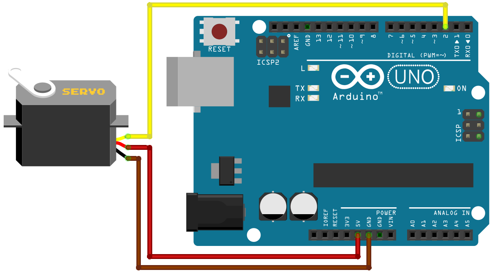
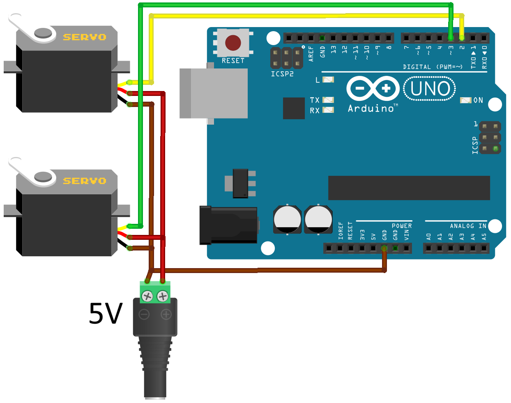

# TekuteruServo (Serial Servo)

TekuteruServo is a serial servo motor that feels just like a standard SG90 but offers near-infinite rotation and precise position control.

Key features include multi-turn positioning (±5.96 million rotations), ±1° angular accuracy, adjustable speeds up to 600 deg/s, and real-time position feedback. While maintaining the same physical dimensions and wiring as the SG90, it supports the same programming methods as the standard Arduino Servo library. 

**Note:** This library uses a custom serial protocol. It is not a PWM-based servo library and cannot be used with standard servos like the SG90. Conversely, the standard `Servo.h` library cannot be used to control TekuteruServo..

The TekuteruServo hardware can be purchased here: [Buy TekuteruServo](https://tekuteru.handcrafted.jp/items/121327019)


## Table of Contents
- [Features](#features)
- [Mechanical Specifications](#mechanical-specifications)
- [Usage Notes & Limitations](#-usage-notes--limitations)
- [Python Support (Raspberry Pi)](#python-support-raspberry-pi)
- [Wiring Guide](#wiring-guide)
- [Installation](#installation-arduino-ide)
- [Class Methods](#class-methods)
- [Code Examples](#code-examples)
- [Support & Feedback](#support--feedback)


## Features
* **High-Precision Multi-turn Positioning:** Supports up to ±5.96 million rotations (-2,147,483,647° to +2,147,483,648°) with ±1° accuracy.
* **Familiar Interface:** Includes `attach()` and `write()` methods, providing **API compatibility** with the standard Arduino Servo library.
* **Universal Compatibility:** Compatible with any digital I/O pin on a wide range of microcontrollers, including **Arduino, ESP32, Raspberry Pi Pico,** and more.
* **Adjustable Dynamics:** Controlled rotation speeds (6–600 deg/s) and real-time angle feedback.
* **Dual-Mode Operation:** Supports both high-precision positioning (angle control) and continuous rotation (speed control).
* **Scalable Servo Control:** No software limit on the number of servos. You can control as many as your board's available I/O pins allow.
* **Seamless Integration:** Uses the same wiring, form factor, and logic voltage (3.3V–5V) as the SG90.
* **Volatile Rotation Count:** While the absolute angle within a single turn (0–359°) is preserved, the multi-turn rotation count resets to zero upon power-up.


## Mechanical Specifications
* **Supply Voltage:** 3.3V - 5V **(Rated 5V)**
  * **Note:** The 3.3V output pins on boards like **Arduino Uno** or **ESP32-DevKitC** often provide insufficient current. Using these pins may lead to unstable operation.
* **Logic Voltage:** 3.3V - 5V
* **Max Speed:** 600 deg/s (approx. 0.1s/60° or 100 rpm) **at 5V**
* **Angular Acceleration:** 5,000 deg/s²
* **Stall Torque:** 1.8 kgf·cm **at 5V**
* **Communication Speed:** 9600 baud (Asynchronous Serial)
* **Gear Material:** Plastic
* **Dimensions:** 32.3 x 12 x 32 mm (Compatible with SG90 standard)
* **Weight:** 10 g
* **Cable Length:** 24 cm


## ⚠ Usage Notes & Limitations
* **Pin Assignment:** Each I/O pin is designed to control one motor. However, multiple motors can be controlled via a single pin for "broadcast" commands that do not require feedback, such as `write()` (with `wait=false`), `writeRotation()`, `stop()`, `setHold()`, and `setZero()`.
* **Power Stability:** Ensure a stable power supply. **Insufficient current can lead to unexpected malfunctions or erratic behavior.** Adding a large capacitor (e.g., 1000μF or higher) across the power lines can further improve stability, especially during high-torque movements.
* **Timing & Interrupts:** * **Interrupts:** Using hardware/software interrupts in your sketch may disrupt serial communication timing, leading to **unexpected malfunctions or erratic behavior**.
* **Magnetic Fields:** Do not use the motor near strong magnetic fields (e.g., large magnets, high-power cables), as they may interfere with the internal magnetic encoder and cause positioning errors.
* **Handle with care:** Internal wiring is delicate; excessive force may cause disconnection.


## Python Support (Raspberry Pi)
For users looking to control TekuteruServo using **Python on Raspberry Pi**, please refer to the dedicated Python library:
[TekuteruServo-Python](https://github.com/tekuteru/TekuteruServo-Python)


## Wiring Guide
TekuteruServo follows the standard SG90 wiring convention:

| Wire Color | Function | Connection      |
|------------|----------|-----------------|
| Brown      | GND      | Arduino GND     |
| Red        | VCC      | 5V Power Supply |
| Yellow     | Signal   | Arduino I/O pin |




## Installation (Arduino IDE)
1. Open the **Arduino IDE**.
2. Open the **Library Manager**.
3. In the search bar, type **"TekuteruServo"**.
4. Select the latest version and click **Install**.


## Class Methods

### `attach(pin)`
Attaches the servo to the specified pin. You can attach a servo to any available digital I/O pin on your board.
- **`pin`**: `uint8_t`

---

### `write(angle)`
Rotates to the target angle at maximum speed (600 deg/s).  
Upon power-up, the current position is recognized within the 0° to 359° range.
- **`angle`**: `int32_t` (Range: `-2,147,483,648` to `2,147,483,647`)

---

### `write(angle, speed)`
Rotates to the target angle at a specified speed value (0–255).
> **Note on Voltage:** The following speed values and calculations are based on a **5V power supply**. If the supply voltage is lower (e.g., 3.3V) or the current is insufficient, the motor will not reach these speeds.

- **0**: Stop
- **1**: Minimum speed (6 deg/s or 1 rpm)
- **255**: Maximum speed (600 deg/s or 100 rpm)

**Speed Mapping Examples (at 5V):**
To set the speed based on your preferred unit:
* **Degrees per second:** `SpeedValue = map(AngularVelocity, 6, 600, 1, 255);`
* **Rotations per minute:** `SpeedValue = map(RPM, 1, 100, 1, 255);`

| Speed Value (0–255) | Angular Velocity [deg/s] | RPM |
|---------------------|--------------------------|-----|
| 0 (Stop)            | 0                        | 0   |
| 1                   | 6                        | 1   |
| 127                 | 303                      | 50  |
| 255                 | 600                      | 100 |

**Note on Velocity Accuracy:**
* **Speed Variance:** The actual rotation speed may vary by up to ±5% from the specified value.
* **Timing Variance:** Due to this variance and power supply stability, the time taken to reach the target angle may differ from theoretical calculations.
* **Precision Control:** For tasks requiring precise long-term speed control, it is recommended to periodically send target positions to compensate for any drift.

---

### `write(angle, speed, wait)`
Rotates to the target angle.
- **`angle`**: Target position in degrees (`int32_t`).
- **`speed`**: Rotation speed from `1` (6 deg/s) to `255` (600 deg/s). `0` stops the motor.
- **`wait`**: If set to `true`, the function blocks until the motor reaches the target position (within ±1°).

---

### `writeRotation(speed)`
Starts continuous rotation at a specified velocity. The motor will continue to spin until a new command is called.

`speed`: `int16_t` (Range: `-255` to `255`)
- **`1` to `255`**: Forward rotation (Counter-clockwise). `255` corresponds to 600 deg/s.
- **`-1` to `-255`**: Reverse rotation (Clockwise).
- **`0`**: Stops the motor (equivalent to `stop()`).

**Note on Speed Stability:**
* **Range Limit:** It cannot rotate beyond the range of `-2,147,483,648°` to `+2,147,483,647°`.
* **Load Handling:** If an external load causes the speed to drop, the motor maintains the specified output but will not accelerate beyond the set speed to catch up. It ensures the motor never exceeds the defined velocity.

---

### `read()`
Returns the current angle in degrees (rounded to the nearest integer).
- **Returns**: `int32_t`
- **Error Handling**: Returns `-2,147,483,648` if a communication error occurs (i.e., no response from the motor within 50ms).

---

### `stop()`
Immediately stops the servo at its current position.

---

### `wait()`
Blocks execution until the current movement is completed.

---

### `isMoving()`
Returns `true` if the servo is currently rotating, and `false` if it is stopped.
- **Returns**: `bool`
- **Error Handling**: Also returns `false` if a communication error occurs (timeout after 50ms without a response).

---

### `setHold(hold)`
Configures holding behavior.  
- **`true` (Default)**: Actively maintains its position against external force.
- **`false`**: "Free move" state; allows manual rotation, though angular accuracy may decrease.

**Note:**
**Data Loss during Manual Rotation:**
When `hold` is set to `false`, manually rotating the shaft by hand may cause the internal multi-turn rotation count to be lost or become inaccurate. To maintain an accurate position during manual movement, it is strongly recommended to **periodically call `read()`** to update the internal state.

---

### `setZero()`
Sets the current absolute position (0–359°) as the 0° reference point. This is saved to non-volatile memory (EEPROM/Flash) and persists after power cycles. Ongoing rotations will stop when this is called.
**Note:** Only the absolute angle (0-359) is saved; the rotation count is reset.


## Code Examples

### 1. Basic Rotation
```arduino
#include <TekuteruServo.h>

TekuteruServo myservo;

void setup() {
  myservo.attach(2);
}

void loop() {
  myservo.write(180);  // Move to 180 degrees
  delay(3000);

  myservo.write(-180);  // Move to -180 degrees
  delay(3000);

  myservo.write(540);  // Move to 540 degrees
  delay(3000);
}
```

### 2. Speed control
```arduino
#include <TekuteruServo.h>

TekuteruServo myservo;

void setup() {
  myservo.attach(2);
}

void loop() {
  myservo.write(180, 0);  // No rotation
  delay(3000);

  myservo.write(-180, 100);  // Move to -180 degrees with speed value 100
  delay(3000);

  myservo.write(540, 255);  // Move to 540 degrees with speed value 255 (max speed)
  delay(3000);

  // Example: Setting speed in degrees per second [deg/s]
  int angularVelocity = 300;  //300 [deg/s]
  myservo.write(-180, map(angularVelocity, 6, 600, 1, 255));
  delay(3000);

  // Example: Setting speed in rotations per minute [rpm]
  int rpm = 50;  //50 [rpm]
  myservo.write(540, map(rpm, 1, 100, 1, 255));
  delay(3000);
}
```

### 3. Wait for movement to complete
```arduino
#include <TekuteruServo.h>

TekuteruServo myservo;

void setup() {
  myservo.attach(2);
}

void loop() {
  myservo.write(180, 255, true);  // Move to 180 degrees, Wait for completion

  myservo.write(-180, 255, true);  // Move to -180 degrees, Wait for completion

  myservo.write(540, 255, false);  // Move to 540 degrees
  myservo.wait();                  // Wait until myservo finishes rotating
}
```

### 4. Read the current angle
```arduino
#include <TekuteruServo.h>

TekuteruServo myservo;

long currentAngle;  // Declare it as a long(int32_t) type.

void setup() {
  Serial.begin(9600);  // Start serial communication (Set the serial monitor to 9600 baud.)

  myservo.attach(2);

  currentAngle = myservo.read();  // Read the current angle (0 ≤ angle < 360)
  Serial.println(currentAngle);   // Display on serial monitor
}

void loop() {
  myservo.write(360, 255, true);  // Move to 360 degrees, Wait for completion
  currentAngle = myservo.read();  // Read the current angle (360±1)
  Serial.println(currentAngle);

  myservo.write(0, 255, true);    // Move to 0 degrees, Wait for completion
  currentAngle = myservo.read();  // Read the current angle (0±1)
  Serial.println(currentAngle);

  myservo.write(3600);  // Move to 3600 degrees
  delay(1000);
  currentAngle = myservo.read();  // Read the current angle
  Serial.println(currentAngle);
}
```

### 5. Multiple servos
**Note:** When operating multiple servos simultaneously, using an external power supply is highly recommended to ensure stable operation and prevent voltage drops. **When using an external power supply, ensure that the GND of the power supply is connected to both the servos and the Arduino GND to maintain a common reference voltage.**


```arduino
#include <TekuteruServo.h>

TekuteruServo myservo1, myservo2;  // There is no software limit on the number of servos

void setup() {
  myservo1.attach(2);
  myservo2.attach(3);
}

void loop() {
  myservo1.write(180);
  myservo2.write(-90);
  myservo1.wait();  // Wait until myservo1 finishes rotating
  myservo2.wait();  // Wait until myservo2 finishes rotating

  myservo1.write(-90, 255, true);

  myservo2.write(180, 255, true);

  myservo1.write(-180, 255);
  myservo2.write(-180, 255, true);
  myservo1.wait();
}
```

### 6. Continuous Rotation
```arduino
#include <TekuteruServo.h>

TekuteruServo myservo;

void setup() {
  myservo.attach(2);
}

void loop() {
  myservo.writeRotation(100);  // Rotate forward with speed value 100
  delay(3000);

  myservo.writeRotation(-255);  // Rotate in reverse at max speed (approx. 100 rpm)
  delay(3000);

  // Example: Setting speed in degrees per second [deg/s]
  int AngularVelocity = 300;
  int16_t SpeedValue = map(AngularVelocity, 6, 600, 1, 255);
  myservo.writeRotation(SpeedValue);  // Forward at 300 [deg/s]
  delay(3000);

  // Example: Setting speed in rotations per minute [rpm]
  int RPM = 50;
  SpeedValue = map(RPM, 1, 100, 1, 255);
  myservo.writeRotation(-SpeedValue);  // Reverse at 50 [rpm]
  delay(3000);

  myservo.writeRotation(0);  // Stop (Same as calling stop())
  delay(2000);
}
```

### 7. Set Zero
```arduino
#include <TekuteruServo.h>

TekuteruServo myservo;

void setup() {
  Serial.begin(9600);

  myservo.attach(2);

  myservo.setHold(false);  // the servo will not hold its position

  myservo.setZero();  // Set the current angle to 0 degrees (Multiple rotations are not saved)

  Serial.println("setZero successful");
}

void loop() {
}
```


## Support & Feedback
* **Library Design:** Inspired by the [VarSpeedServo](https://github.com/netlabtoolkit/VarSpeedServo) library.
* **Feedback:** This documentation was prepared with the help of translation tools. If you encounter any technical issues or have suggestions for improving the documentation or English expressions, please contact us at: tekuteruteku@gmail.com
